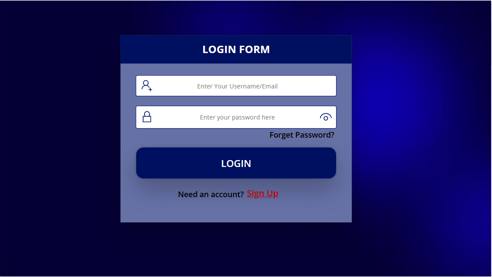
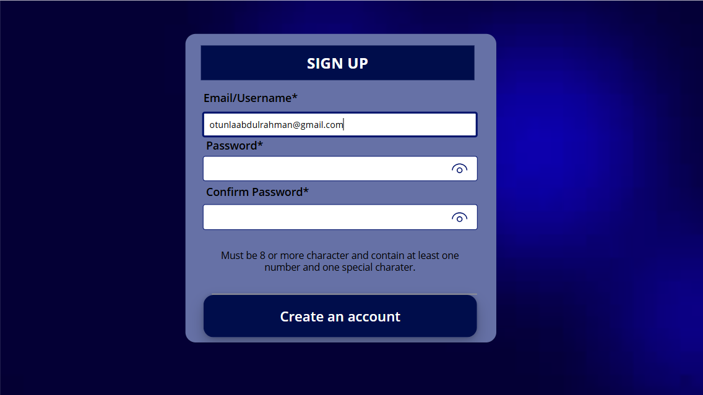
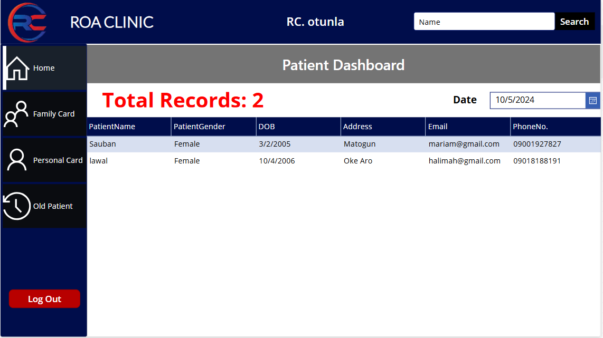
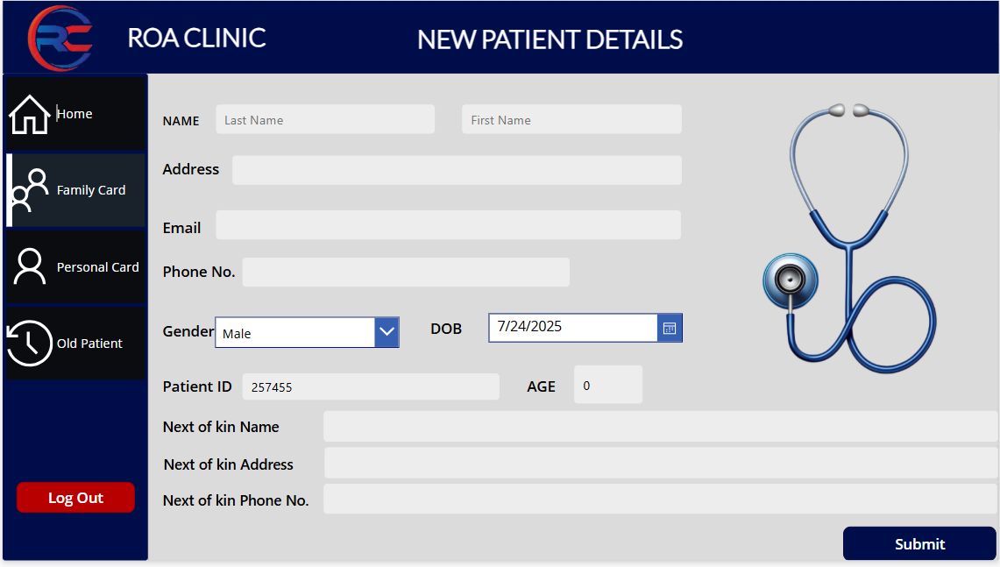
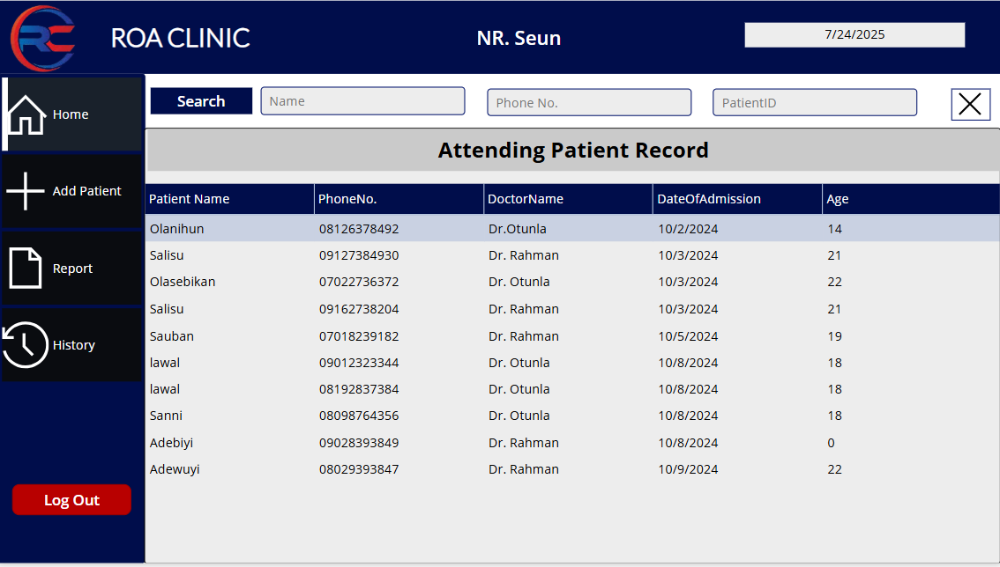
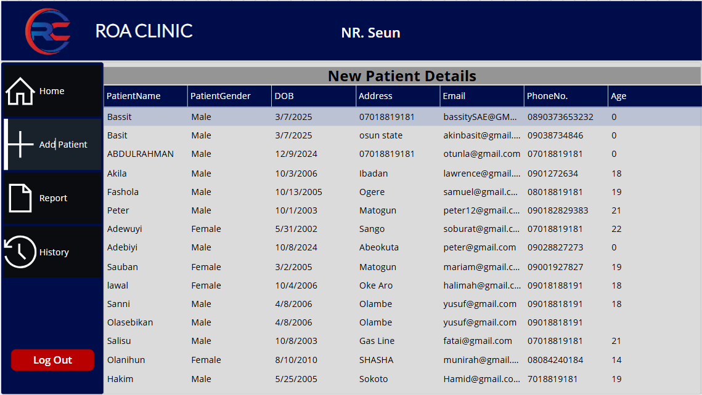
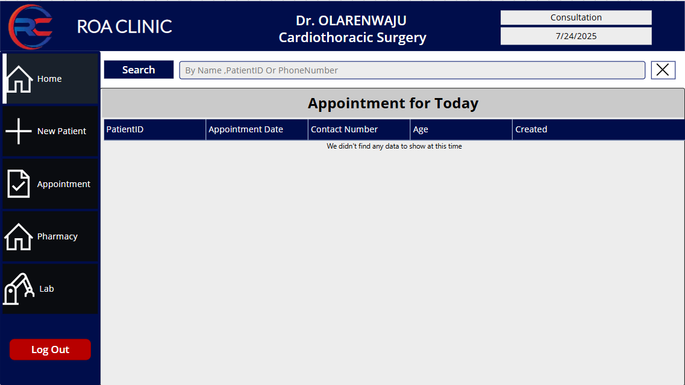
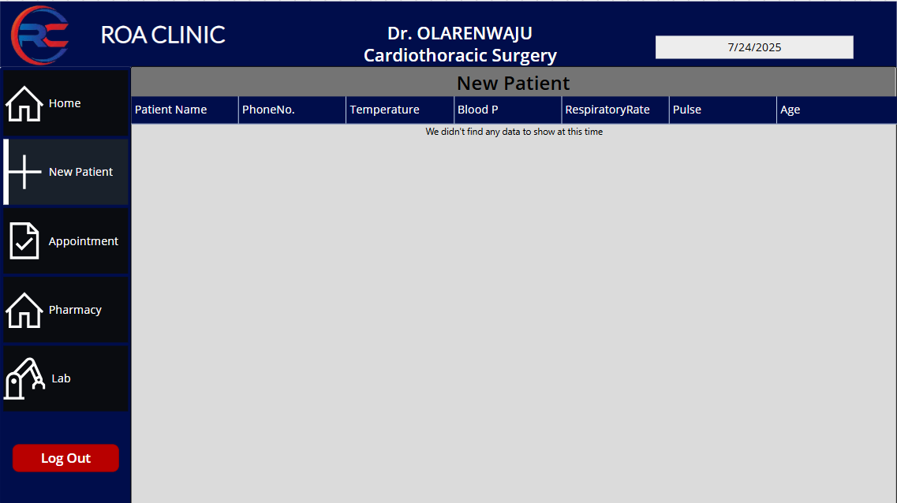

# 🏥 Hospital_Management_App

**Data Portfolio:** Power Apps – SharePoint – Power Fx – GitHub

## 📑 Table of Contents

- [🎯 Objective](#-objective)
- [👤 User Story](#-user-story)
- [🏗️ App Architecture](#-app-architecture)
- [🎨 Design](#-design)
- [🛠️ Tools](#-tools)
- [💻 Development](#-development)
- [📊 Data Structure](#-data-structure)
- [🧠 Power Fx Logic](#-power-fx-logic)
- [🧭 Navigation](#-navigation)
- [📈 Visualization](#-visualization)
- [✅ Conclusion](#-conclusion)

---

## 🎯 Objective

### What is the main goal?

To build a **hospital workflow management system** using **Power Apps Canvas App**, focused on digitizing patient flow from **reception to doctor consultation**, including **lab requests** and **pharmacy processes**.

### What is the ideal solution?

A **secure, mobile-first responsive** solution that supports:

- Staff login with role-based access
- Patient intake (new/returning)
- Nurse vitals and diagnosis entry
- Doctor diagnosis, drug prescriptions, and lab requests
- Pharmacy/lab access
- Appointment scheduling
- Dashboards for each role

---

## 👤 User Story

As a hospital staff (Receptionist, Nurse, or Doctor), I want an intuitive app to:

- Register patients (Personal or Family card)
- Record vitals and medical history
- Schedule and manage appointments
- Handle prescriptions and lab tests
- View patient records securely
- Manage staff details via login

---

## 🏗️ App Architecture

### Screens/Pages

- **🧑‍⚕️ Login & Sign-Up**
  - Login (Email, Password)
  - New Staff Sign-Up

- **💼 Receptionist Portal**
  - Dashboard (today’s patients)
  - New Registration (Personal/Family)
  - Old Patient Lookup
  - Forward to Nurse

- **🏥 Nurse Portal**
  - Dashboard (assigned patients)
  - Record Vitals & Initial Diagnosis
  - View Patient History

- **🩺 Doctor Portal**
  - Appointment Schedule
  - Diagnosis Page
  - Prescriptions
  - Lab Requests
  - Pharmacy Lookup

---

## 🎨 Design

- Modern, responsive layout with containers
- Role-based screen visibility
- Reusable components (forms, galleries)
- Consistent theming using Power Apps CoE Toolkit

---

## 🛠️ Tools

| Tool        | Purpose                      |
|-------------|------------------------------|
| Power Apps  | UI and Logic Development     |
| SharePoint  | Backend Data Storage         |
| Power Fx    | App Logic and Formulas       |
| GitHub      | Documentation & Versioning   |

---

## 💻 Development

### SharePoint Lists Used:

| List Name     | Description                        |
|---------------|------------------------------------|
| Patients      | Patient registration data          |
| Vitals        | Nurse diagnosis & vitals           |
| Appointments  | Doctor-patient schedules           |
| Drugs         | Pharmacy inventory                 |
| Labs          | Lab test requests                  |
| Doctors       | Doctor staff records               |
| Staff         | Staff login and credentials        |

---

## 📊 Data Structure

Each SharePoint list includes columns like:

- Patients: FirstName, LastName, DOB, Age, Gender, PatientID
- Vitals: PatientID, Temperature, BP, Diagnosis, NurseName
- Appointments: PatientID, DoctorName, Date, Time, Status
- Staff: FullName, Role, Gender, Department, Email, Password

  
### POWER FX 
```FX

-- 1. Login Button :

  Set(
    LoggedInUser,
    LookUp(
        'Staff Details',
        Username = TextInput3.Text && Password = TextInput3_1.Text
    )
);

If(
    !IsBlank(LoggedInUser),
    If(
        LoggedInUser.Role.Value = "Nurse",
        Navigate('Nurse Home Page', ScreenTransition.Fade),
        
        LoggedInUser.Role.Value = "Doctor",
        Navigate('Doctor Page', ScreenTransition.Fade),
        
        LoggedInUser.Role.Value = "Receptionist",
        Navigate('Receptionist/Medical Record page', ScreenTransition.Fade)
    ),
    
    Notify("Incorrect Username or Password! Ask your Admin to change it.", NotificationType.Error)
);

Reset(TextInput3);
Reset(TextInput3_1);

-- 2. SignUp Button :
Navigate('SignUp Page',ScreenTransition.Fade)

-- 3. Create Account Button :
If(
    TextInput1_1.Text = TextInput1_2.Text,  
    Set(
        NewUserRecord,
        Patch(
            'Staff Details',
            Defaults('Staff Details'),
            {
                Username: TextInput1.Text,
                Password: TextInput1_1.Text
            }
        )
    );
    
    If(
        !IsBlank(NewUserRecord),
        Navigate('Staff Details Page', ScreenTransition.Fade),
        Notify("Sign-up failed. Please try again.", NotificationType.Error)
    ),
    
    Notify("Passwords do not match. Please try again.", NotificationType.Error)
);


Reset(TextInput1); 
Reset(TextInput1_1); 
Reset(TextInput1_2);

-- 4. Staff Detail Submit Button :
 Patch(
    'Staff Details',
    NewUserRecord,
    {
        Availability: "Available",
        DateOfAdmission: Today(),
        FirstName: TextInput2_26.Text,
        LastName: TextInput2_29.Text,
        Address: TextInput2_45.Text,
        'PhoneNo.': TextInput2_46.Text,
        Email: TextInput2_47.Text,
        Gender: Dropdown1_2.Selected,
        Role: Dropdown1_3.Selected,
        DoctorID: (TextInput2_48.Text),
        Specialization: Dropdown1_15.Selected.Value
    }
);
Reset(TextInput2_26);
Reset(TextInput2_29);
Reset(TextInput2_45);
Reset(TextInput2_46);
Reset(TextInput2_47);
Reset(Dropdown1_2);
Reset(Dropdown1_3);
Reset(TextInput2_48);
Reset(Dropdown1_15);


```
# LOGIN_PAGE

# SIGNUP_PAGE :

# RECEPTIONIST_HOME_PAGE: 

# FAMILY/PERSONAL_CARD

# NURSE_HOME_PAGE

# NURSE_ADD_PATIENT_PAGE

# DOCTOR_HOME_PAGE

# DOCTOR_ADD_PATIENT_PAGE



## ✅ Conclusion
This Power Apps Canvas App is a digital hospital system designed for:

-📋 Patient registration by the receptionist

-🩺 Diagnosis and vitals by nurses

-👨‍⚕️ Appointment and treatment by doctors

-💊 Integration with pharmacy and labs

-📊 Dashboards for real-time hospital activity

-🔐 Secure role-based access for all staff
